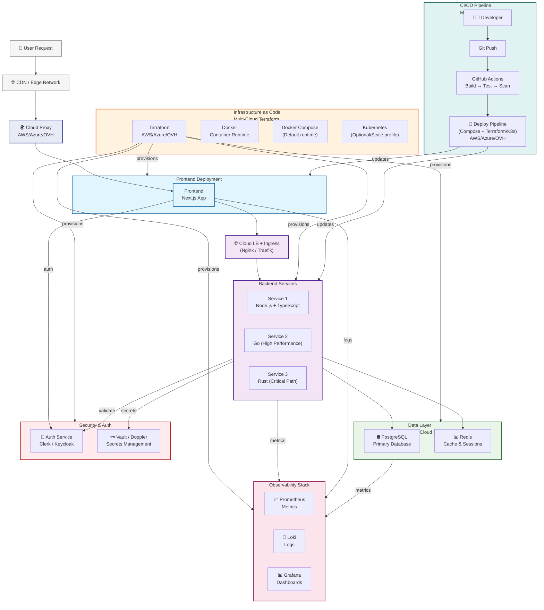

# 🧱 Technical Architecture & Vision

---

## 🧩 Universal CTO Stack
A foundational, opinionated stack for any startup or scale-up — designed for speed, resilience, and observability.

**Summary:**  
This stack defines the baseline architecture to deploy in any new project — covering frontend, backend, infra, monitoring, and security with CI/CD built-in.

📄 Full document → [Choose Your Ideal Technology Foundation (Google Doc)](https://docs.google.com/document/d/1llF80r-saFA7Le0GqJxjPjGU6LN6w6-omrT9sE-SyQM/edit?usp=sharing)  

---

### Security Baseline (Guaranteed)
- Secrets externalized (Vault/Doppler)
- SAST/Dependency scanning in CI
- RBAC enforced on Git & cloud
- Incident response **playbooks** (on-call, escalation, postmortems)

### Security Extensions (Context-driven)
- WAF / DDoS protection
- Encryption at rest
- MFA everywhere
- Compliance mapping (SOC2, ISO)

These are enabled based on regulatory, business, or customer requirements.

Security extensions are explicitly scoped, costed, and activated only when risk or regulation justifies them.

---

## ⚖️ CTO Decision Matrix
A practical decision framework for every architecture choice:  
When to use **Monolith vs Microservices**, **Node.js vs Go**, or **Compose vs Kubernetes**.

📄 Full matrix → [CTO Decision Guide – How to Choose Wisely (Google Doc)](https://docs.google.com/document/d/1llF80r-saFA7Le0GqJxjPjGU6LN6w6-omrT9sE-SyQM/edit?usp=sharing)  

---

## 🧭 Product ↔ Tech Vision Map 
Defines how product strategy translates into concrete technical architecture.  
Includes:
- The core technical bet  
- 3 architecture decisions that matter  
- MVP scope and out-of-scope cuts  
- Service ownership and key metrics  

📄 Full document → [Product–Tech Vision Map (Google Doc)](https://docs.google.com/document/d/18oHu0SalOD7IDXtZ2CMXdHP8R1cU20f6F6gB-q1hrrY/edit?usp=sharing)  

---

## 🗺️ Reference System Architecture (Mermaid Diagram)
Below is the high-level system view that underpins the CTO Golden Repo (execution layer) and its capability packs.  

For detailed architectural doctrines or production-grade operational depth (DDD, distributed systems, runtime topologies, contracts, and evolutionary architecture), refer to the **CTO Operating System** architecture documentation (docs/architecture/*).

This portfolio focuses on strategic architecture vision and proof artifacts, while the Operating System provides production-grade operational depth and codifies day-to-day standards and enforcement in real environments.

---

## 🏗️ Infrastructure & Automation Overview

Synthesis of my deployable foundation — proving Infrastructure-as-Code and automation maturity.

### CTO Golden Repo (Execution Layer)
Full repo → [CTO Golden Repo](https://github.com/matdup/cto-golden-repo)

The CTO Golden Repo is the industrial execution layer of this portfolio:
- apps (frontend + backend with Clean Architecture & DDD)
- infrastructure (Compose-first + Terraform multi-cloud)
- platform (monitoring, security, data, auth)
- governance-aligned structure (ADR, runbooks, contracts, docs)

---

💡 **CTO Takeaway:**  
Architecture is leadership in disguise — this stack makes execution predictable and scalable from day 1, with zero vendor lock-in and enterprise-grade security.