# 🚀 Mat Dupré — CTO Portfolio — 
**Speed with Safety — From Vision to production** Building scalable systems, empowering teams, and turning technology into strategy into measurable business value.  
**Hands-on CTO (0→1 builder + complex legacy environments)** specializing in fintech, infrastructure, and cost-aware scalable systems.
📍 Remote (Europe) — Based in France  
🌍 Open to relocation: USA, Switzerland (long-term CTO / Founding roles) | 💬 [LinkedIn](https://www.linkedin.com/in/mathdupre)

---

## 🎯 Executive Summary

**I architect and deliver complete technology platforms that transform business vision into production-ready systems in days, not months.** This portfolio demonstrates a proven **CTO Execution System** for building scalable, secure, and cost-effective technology organizations from **zero to production-ready and scalable systems**.

It integrates architecture, automation, and leadership frameworks into a unified, deployable system.
This system is concretely implemented through a governance Operating System and a production-grade CTO Golden Repo (industrial execution layer).

I operate as a hands-on CTO, capable of designing, building, and deploying full production-grade systems (architecture, CI/CD, observability, security, and infrastructure) from 0 to MVP, production, and scaling phases.

My approach prioritizes pragmatic execution: ship fast, secure early, and scale only when real usage justifies architectural complexity.

I have operated both as a CTO in 0 to 1 product environments and as a CTO in complex legacy environments requiring architectural reconstruction and governance setup.

🔎 This portfolio complements my CV by providing concrete execution evidence, architecture artifacts, and real-world CTO case studies (0→1 build and legacy system reconstruction).

---

⏱️ 90-second read:
- Executive Overview (diagram)
- Reference Architecture (production system)
- CTO Execution Snapshot (real-world proof)

## 🧭 CTO System Overview (Executive View)

This diagram presents the high-level architecture of the CTO Execution System:
- Edge layer ensures secure and scalable entry (CDN, Gateway)
- Application layer follows modular monolith → microservices evolution with Clean Architecture & DDD
- Data layer prioritizes reliability, auditability, and cost-aware scaling
- Observability is built-in from day one (metrics, logs, alerts, SLOs)
- Governance layer (CTO Operating System) enforces security, CI/CD discipline, incident readiness, and cost control across the entire system

Goal: ship fast, stay secure, and scale without architectural rewrites.

Purpose: show layers + governance overlay.

```mermaid
flowchart TB
    %% =========================
    %% EXECUTIVE CTO VIEW (VERTICAL - README FRIENDLY)
    %% =========================

    %% USER
    User["👤 Users<br/>(Customers / Partners / Internal)"]

    %% EDGE LAYER
    subgraph EdgeLayer["🌐 Edge Layer<br/>CDN • DNS • TLS • WAF • Policy"]
        Edge["🌐 CDN / DNS / TLS / WAF"]
        Gateway["🚪 API Gateway / Ingress<br/>Routing • Auth • Rate Limit"]
        Edge --> Gateway
    end

    %% APPLICATION LAYER
    App["🧩 Application Layer<br/>Frontend (Next.js)<br/>Backend (NestJS / Go / Rust)<br/>Clean Architecture + DDD"]

    %% DATA LAYER
    Data["🗄️ Data Layer<br/>PostgreSQL + Redis + Storage<br/>Auditability & Backups"]

    %% OBSERVABILITY
    Observability["📊 Observability & Reliability<br/>Metrics • Logs • Dashboards • Alerts • SLOs"]

    %% GOVERNANCE
    Governance["🏛️ Governance Layer<br/>CTO Operating System<br/>ADR • CI/CD Gates • Security • FinOps • Runbooks"]

    %% MAIN FLOW (TOP → BOTTOM)
    User --> Edge
    Gateway --> App
    App --> Data
    App --> Observability
    Edge -. signals .-> Observability
    Gateway -. signals .-> Observability
    Data -. signals .-> Observability

    %% GOVERNANCE OVERLAY (EXECUTIVE CONCEPT)
    Governance -. governs .-> Edge
    Governance -. governs .-> Gateway
    Governance -. governs .-> App
    Governance -. governs .-> Data
    Governance -. enforces .-> Observability
```



---

## 🧱 Technical Reference Architecture (Engineering View)

This diagram shows the production-grade technical architecture 
behind the CTO Execution System (multi-cloud, CI/CD, observability, security, IaC).

Purpose: show deployable production system + multi-cloud + CI/CD...

```mermaid
flowchart TD
    %% =========================
    %% USER & EXTERNAL FLOW
    %% =========================
    User["👤 User Request"] --> CDN["🌐 CDN / Edge Network"]
    
    %% =========================
    %% MULTI-CLOUD CONTEXT - 
    %% =========================
    CDN --> Cloud_Proxy["🌍 Cloud Proxy<br/>AWS/Azure/OVH"]
    
    %% =========================
    %% FRONTEND LAYER
    %% =========================
    Cloud_Proxy --> Frontend["Frontend<br/>Next.js App"]
    
    subgraph FrontendDeployment["Frontend Deployment"]
        Frontend
    end
    
    %% =========================
    %% BACKEND & API LAYER
    %% =========================
    Frontend --> API_Gateway["🌐 Cloud LB + Ingress<br/>(Nginx / Traefik)"]
    
    subgraph BackendServices["Backend Services"]
        B1["Service 1<br/>Node.js + TypeScript"]
        B2["Service 2<br/>Go (High Performance)"]
        B3["Service 3<br/>Rust (Critical Path)"]
    end
    
    API_Gateway --> BackendServices
    
    %% =========================
    %% DATA LAYER - MULTI-CLOUD MENTION
    %% =========================
    subgraph DataLayer["Data Layer<br/>Multi-Cloud Ready"]
        PostgreSQL["🛢️ PostgreSQL<br/>Primary Database"]
        Redis["📊 Redis<br/>Cache & Sessions"]
    end
    
    BackendServices --> PostgreSQL
    BackendServices --> Redis
    
    %% =========================
    %% INFRASTRUCTURE & SECURITY - MULTI-CLOUD
    %% =========================
    subgraph Infrastructure["Infrastructure as Code<br/>Multi-Cloud Terraform"]
        Terraform["Terraform<br/>AWS/Azure/OVH"]
        Docker["Docker<br/>Container Runtime"]
        Compose["Docker Compose<br/>(Default runtime)"]
        K8s["Kubernetes<br/>(Optional/Scale profile)"]
    end
    
    subgraph Security["Security & Auth"]
        Auth["🔐 Auth Service<br/>Clerk / Keycloak"]
        Vault["🗝️ Vault / Doppler<br/>Secrets Management"]
    end
    
    %% =========================
    %% OBSERVABILITY
    %% =========================
    subgraph Observability["Observability Stack"]
        Prometheus["📈 Prometheus<br/>Metrics"]
        Loki["📝 Loki<br/>Logs"]
        Grafana["📊 Grafana<br/>Dashboards"]
    end
    
    %% =========================
    %% DEVELOPMENT WORKFLOW - MULTI-CLOUD DEPLOY
    %% =========================
    subgraph CICD["CI/CD Pipeline<br/>Multi-Cloud Deploy"]
        Developer["👨‍💻 Developer"] --> Git["Git Push"]
        Git --> GH_Actions["GitHub Actions<br/>Build → Test → Scan"]
        GH_Actions --> Deploy["🚀 Auto Deploy<br/>AWS/Azure/OVH"]
    end
    
    %% =========================
    %% CRITICAL CONNECTIONS - CORRIGÉES
    %% =========================
    %% Infrastructure manages everything (solid arrows)
    Terraform -->|provisions| FrontendDeployment
    Terraform -->|provisions| BackendServices
    Terraform -->|provisions| DataLayer
    Terraform -->|provisions| Security
    Terraform -->|provisions| Observability
    
    %% All components report to observability
    BackendServices -->|metrics| Observability
    Frontend -->|logs| Observability
    DataLayer -->|metrics| Observability
    
    %% Authentication flows
    Frontend -->|auth| Auth
    BackendServices -->|validate| Auth
    BackendServices -->|secrets| Vault
    
    %% CI/CD deploys to infrastructure
    Deploy -->|updates| BackendServices
    Deploy -->|updates| FrontendDeployment
    
    %% =========================
    %% STYLING - AMÉLIORÉ
    %% =========================
    classDef frontend fill:#e1f5fe,stroke:#01579b,stroke-width:2px
    classDef backend fill:#f3e5f5,stroke:#4a148c,stroke-width:2px
    classDef data fill:#e8f5e8,stroke:#1b5e20,stroke-width:2px
    classDef infra fill:#fff3e0,stroke:#e65100,stroke-width:2px
    classDef security fill:#ffebee,stroke:#b71c1c,stroke-width:2px
    classDef monitoring fill:#fce4ec,stroke:#880e4f,stroke-width:2px
    classDef cicd fill:#e0f2f1,stroke:#004d40,stroke-width:2px
    classDef external fill:#f5f5f5,stroke:#666,stroke-width:1px
    classDef multicloud fill:#e8eaf6,stroke:#303f9f,stroke-width:2px
    
    class FrontendDeployment,Frontend frontend
    class BackendServices,API_Gateway backend
    class DataLayer data
    class Infrastructure infra
    class Security security
    class Observability monitoring
    class CICD cicd
    class User,CDN,Cloud_Proxy external
    class Cloud_Proxy multicloud
```



---

## ⚡ CTO Execution Snapshot (What I Actually Deliver)

Hands-on CTO with end-to-end ownership from architecture to production in regulated, high-complexity, and resource-constrained environments.

### 🚀 CTO Execution — TokAssets (Fintech & Tokenization Infrastructure)
- Designed and led the architecture of a compliance-first tokenization platform (fintech UX, blockchain-secure core) from 0 to production
- Built a modular backend (Rust + Clean Architecture + DDD) for scalability, auditability, and regulatory adaptability
- Implemented compliance-by-design workflows and auditability patterns(KYC/AML, custody, ...) aligned with MiCA, SEC Reg A+, FINMA, VARA (jurisdiction-dependent)
- Structured white-label infrastructure for banks, wealth managers, and institutional distribution
- Led CI/CD, infrastructure automation (Docker, Terraform), monitoring, and incident-ready observability
- Established governance foundations: documentation standards, audit readiness, ownership model, and technical operating framework
- Improved system performance and on-chain/off-chain synchronization (~30% latency reduction)


### 🧩 CTO Execution in Complex Legacy Environment — Swisstronik
- Took over a large multi-repository environment (~90+ repositories) without prior handover
- Audited distributed infrastructure (OVH servers, validators, RPC, backend services)
- Reconstructed technical architecture, infrastructure mapping, and repository classification to restore full infrastructure and system visibility
- Mapped Server ↔ Repository ↔ Services relationships to support HLD documentation and governance
- Established technical governance foundations (documentation standards, auditability, ownership model)
- Made strategic technical decisions under an absence of documentation, legacy complexity, and organizational constraints

### 🧱 Real-World Platform Engineering
- Designed full technology foundations (architecture, CI/CD, observability, security) from 0 to production-ready systems
- Built deployable multi-cloud infrastructure templates (OVH / AWS / Azure) using Terraform + Docker
- Designed and built a CTO Golden Repo: an industrial, governance-aligned execution repository enabling <10 min environment bootstrap (apps + infra + platform + observability)
- Implemented cost-aware architecture strategies (Compose-first, scale-by-evidence, FinOps guardrails)
- Established governance systems (ADR, runbooks, SLOs, CI/CD enforcement) for audit-ready operations


### Delivery Philosophy
Ship fast. Secure early.  
Document decisions.  
Scale only when evidence justifies complexity.

---

## 💸 Cost & FinOps — Budget-Aware CTO Strategy

This portfolio is designed with **cost as a first-class architectural constraint**.

### Core Principles
- Start with **cost-efficient defaults**, not hyperscaler dogma
- Prefer **simple infrastructure** over premature scalability
- Scale **only when usage, revenue, or risk justify it**
- Treat cloud providers as **replaceable vendors**, not strategic dependencies

### Default Cost-Conscious Choices
- Docker Compose before Kubernetes
- Single region before multi-region
- Managed services only when operational savings outweigh cost
- Observability scoped to actionable signals (no vanity metrics)
- Infrastructure sized for **real traffic, not projected fantasies**

### FinOps Guardrails
- Monthly budget and alert thresholds per environment
- Cost ownership assigned per service or team
- Regular cost reviews (monthly MVP / quarterly scale)
- Architecture decisions documented with **cost impact** in ADRs

### CTO Position
> “Scalability is not a goal.  
> **Sustainable growth at controlled cost is.**”

This framework prevents over-engineering, vendor lock-in, and runaway cloud spend — while keeping the system **ready to scale when it actually matters**.

---

## 🌟 Key Achievements

### 🏆 **Multi-Cloud Platform Engineering**
**Built a universal cloud abstraction layer** that deploys identical infrastructure across OVH, AWS, and Azure with a single command:
```bash
terraform apply -var="cloud_provider=aws|azure|ovh"
```
- **80% faster** deployment time vs traditional approaches
- **Zero vendor lock-in** with cloud-agnostic architecture
- **Enterprise security** with Vault integration and automated scanning
- **Production-ready** monitoring and observability stack

---

## 🎯 Core Artifacts

**CTO Execution System (3 layers):**
- **Strategic Layer (Docs):** Portfolio & Core Docs (Stack Foundation Kit + Decision Matrix + Product–Tech Vision Map...)
- **Execution Layer (Code):** CTO Golden Repo — industrial, deployable starter repository (apps, infra, platform, governance-aligned structure) 
- **Operating System (Governance):** CTO Operating System repo

Together, these three layers form a complete CTO Execution System:
strategy (Portfolio & Foundation Framework), governance (Operating System), and execution (CTO Golden Repo).

### 🧱 Full document → [Technical Architecture & Vision](ARCHITECTURE.md)
- **Universal CTO Stack** - (frontend, backend, infra, monitoring, security)
- **Decision Matrix** - Architecture trade-offs (Monolith vs Microservices, Node vs Go, etc.)
- **Product ↔ Tech Vision Map** - linking business strategy to system design
- **Reference System Diagram** + Infrastructure as a Code (IaC) overview

💡 *Goal: a reproducible, audit-ready architecture deployable in minutes.*

### 🧭 Full document → [Leadership Frameworks](LEADERSHIP.md)
- **CTO Manifesto** – leadership operating system
- **Tech Radar & Roadmap Framework** – Technology adoption & strategic focus
- **FinOps & Risk Matrix** – Cost control & risk visibility
- **CTO Operating System** – Operational Governance System
(Architecture, Security, SLOs, Incident Response, Compliance, and Engineering Operating Model)
- **Strategic Storytelling** – 3 CTO pitches (CEO / Team / Investors)

💡 *Goal: transform technical execution into organizational trust and business clarity.*

### 🧭 CTO Operating System (Governance Layer)
This portfolio shows **vision + proof**. The CTO Operating System is the **governance operating system** behind it — the day-to-day standards that make delivery fast, safe, and auditable.

It contains:
- **Governance & decision-making:** ADR / RFC discipline, ownership model, compliance baseline
- **Engineering execution:** dev process, QA gates, CI/CD & release discipline
- **Production operations:** incident management, on-call & escalation, runbooks, DR (RPO/RTO)
- **Architecture doctrine:** DDD boundaries, contracts/versioning, distributed patterns, SLO engineering, security/threat modeling
- **Enforcement:** CODEOWNERS, repo compliance contract, quarterly audits & evidence records

📁 Repository → [CTO Operating System](https://github.com/matdup/cto-operating-system)

### 🧭 Full document → [Scalability, Security & Reliability](SCALABILITY_SECURITY_RELIABILITY.md)
- **Production KPIs & SLO Targets** – latency p95, availability 99.9%, MTTR/MTTD, DORA metrics  
- **Scale Model (1K → 100K → 1M users)** – progressive evolution & evidence-based triggers  
- **Performance Engineering** – rate limiting, connection pooling, query rules, load testing (k6)  
- **Distributed Systems Strategy** – CAP tradeoffs, outbox/saga, retries/DLQ, backpressure & load shedding  
- **Multi-Tenant Isolation** – tenant boundaries, progressive isolation levels, auditability  
- **Security Architecture** – STRIDE threat modeling, encryption strategy, key management, abuse protection  

💡 *Goal: a production-grade scaling + reliability doctrine, aligned with measurable SLOs and cost-aware growth.*  
📘 *Deep operational standards live in the* **[CTO Operating System](https://github.com/matdup/cto-operating-system)** *(docs/architecture/*).*

### 🏗️ CTO Golden Repo — Execution Layer (Deployable Foundation)
**Objective:** build a bulletproof industrial foundation deployable in **< 10 minutes**.

Full repo → [CTO Golden Repo](https://github.com/matdup/cto-golden-repo)

This repository is a production-ready, governance-aligned foundation with CI/CD, IaC, security scanning, and observability built-in.
It can bootstrap a company in hours — not weeks.

| Capability | Location (cto-golden-repo) | Key Features |
|-----------|-----------------------------|--------------|
| Infrastructure | https://github.com/matdup/cto-golden-repo/tree/main/apps/infrastructure | Docker Compose runtime + Terraform multi-env (dev/staging/prod) + multi-cloud abstraction |
| Backend (Node / NestJS) | https://github.com/matdup/cto-golden-repo/tree/main/apps/backend/nestjs-app | Clean Architecture + DDD contexts + shared cross-cutting (security/tenancy/observability) |
| Backend (Go) | https://github.com/matdup/cto-golden-repo/tree/main/apps/backend/go-service | High-performance service skeleton + health endpoint + Docker |
| Frontend (Next.js) | https://github.com/matdup/cto-golden-repo/tree/main/apps/frontend | Next.js + TS + i18n-ready + E2E smoke (Playwright) + Docker |
| Contracts | https://github.com/matdup/cto-golden-repo/tree/main/contracts | OpenAPI v1 + schemas + compat rules + contract-tests |
| Observability / Monitoring | https://github.com/matdup/cto-golden-repo/tree/main/platform/monitoring | Grafana + Prometheus + Loki + Alertmanager + SLO rules + runbooks + compose |
| Security Tooling | https://github.com/matdup/cto-golden-repo/tree/main/platform/security | Gitleaks + SBOM (Syft) + Trivy config + security policies |
| Docs (MkDocs) | https://github.com/matdup/cto-golden-repo/tree/main/docs | MkDocs site + ADRs + architecture/guides/tech-runbooks |
| Governance Pack | https://github.com/matdup/cto-golden-repo/tree/main/governance | FinOps, risk matrix, retention, classification, repo constraints, ownership model |
| Ops Runbooks | https://github.com/matdup/cto-golden-repo/tree/main/ops-runbooks | Incident response + rollback + DR + security incident procedures |
| Automation Scripts | https://github.com/matdup/cto-golden-repo/tree/main/scripts | Deploy/healthcheck/backup/migrate/rollback helpers |

---

## Stack Coverage — Reality Check

| Domaine | Implemented | Ready to Enable | Out of Scope (by design) |
|------|-------------|-----------------|--------------------------|
| CI/CD | GitHub Actions, rollback | Blue/Green | — |
| Observability | Logs, metrics, alerting, SLO targets | Tracing | — |
| Security | Vault, SAST, RBAC | WAF, encryption at rest | HSM |
| Data | PostgreSQL, Redis | Read replicas | Kafka |
| Compute | Docker, Compose | Kubernetes | Serverless |
| Product (i18n-ready frontend) | i18n-ready architecture | Localization, SEO | — |

### Product, data & business — Frontend multi-language (i18n / l10n)

| Item | MVP | Scale | Regulated | 💸 |
|------|-----|-------|-----------|----|
| i18n strategy (target languages, ownership, workflow) | ⭕ | 🟡 | 🟢 | ↓ |
| UI internationalization (i18n framework) | ⭕ | 🟡 | 🟢 | ↓ |
| Localization (dates, currencies, timezones, pluralization) | ❌ | 🟡 | 🟢 | ↓ |
| Localized routing & URLs (/fr, /en) | ❌ | 🟡 | 🟢 | ↓ |
| Translation management (files, TMS, review process) | ❌ | 🟡 | 🟢 | ↓ |
| Fallback & coverage (missing keys, QA) | ❌ | 🟡 | 🟢 | ↓ |
| Multi-language SEO (hreflang, sitemaps) | ❌ | 🟡 | 🟢 | ↓ |
| Localized legal content (T&Cs, privacy, consent) | ❌ | ⭕ | 🟢 | ↓ |

**Quick interpretation**
- **MVP (⭕):** not necessarily translated, but i18n-ready architecture + clear strategy (otherwise massive future debt).
- **Scale (🟡):** actual i18n activation with a translation workflow.
- **Regulated (🟢):** localized legal content with traceability requirements.

---

💡 **CTO Insight:**
Your stack is your strategy. This execution system translates architecture into delivery discipline and market speed.

---

### 🧠 Strategic Differentiation

This framework represents a battle-tested methodology for building robust, observable, and scalable tech organizations.

---

### The **Speed With Safety** Advantage
- Multi-cloud agility without complexity overhead  
- Enterprise security without bureaucratic processes  
- Production monitoring without manual setup  
- Team scalability without tribal knowledge 

---

### Business Impact Delivered

| Challenge | Solution | Outcome |
|------------|-----------|----------|
| Slow time-to-market | CTO Golden repo + automation | Weeks → Hours |
| Cloud vendor risk | Cloud-agnostic architecture | Negotiation leverage |
| Security compliance | Built-in scanning + Vault | Audit readiness |
| Cost predictability | Multi-cloud + FinOps | 30–50% optimization |

---

### 🎖️ Leadership Signature

I build capabilities, not just systems:

- **Technical Excellence** that delivers measurable business outcomes  
- **Strategic Foresight** that anticipates market shifts  
- **Operational Discipline** that ensures reliability at scale  
- **Team Empowerment** that multiplies organizational capacity  

Let's discuss how we can apply these patterns to accelerate your technology strategy.

---

## 🧠 About this Portfolio
This portfolio presents a **CTO Execution System** — a reusable execution model for building robust, observable, and scalable tech organizations.

It combines:
- **Strategic Vision** → Product ↔ Tech alignment  
- **Technical Execution** → Industrial-grade CI/CD & IaC  
- **Operational Excellence** → FinOps, Observability, Governance  
- **Leadership** → Clear communication, playbooks, and systems thinking  

---

**I build teams and systems that scale without chaos.**

---

This portfolio defines a complete CTO Execution System, designed to be adapted to any company context.
It is not a fixed stack, but a decision framework that evolves with product maturity, regulatory constraints, and organizational scale.

---

📎 For contact or speaking inquiries: [LinkedIn](https://www.linkedin.com/in/mathdupre)